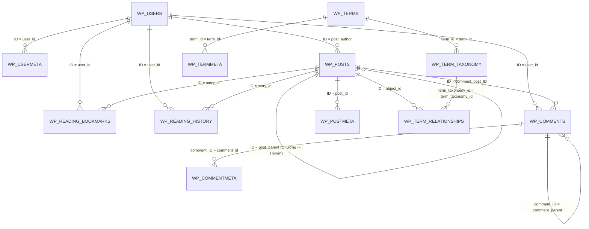

# 🗄️ TÀI LIỆU CƠ SỞ DỮ LIỆU (DATABASE SCHEMA)
### Website Đọc Truyện: Mướp Đắng Cũng Có Vị Ngọt

Tài liệu này tổng hợp toàn bộ cấu trúc, ý nghĩa các bảng dữ liệu (Tables), khóa chính (Primary Key), khóa duy nhất (Unique), khóa liên kết logic (Foreign Key) và chỉ mục (Indexes) trong cơ sở dữ liệu của dự án.

---

## 📌 1. TỔNG QUAN HỆ THỐNG CƠ SỞ DỮ LIỆU

- **Hệ quản trị CSDL:** MariaDB / MySQL (chạy qua XAMPP hoặc máy chủ độc lập).
- **Database chính thức của Website:** `webtruyen_zhihu`
- **Số lượng bảng:** **15 bảng** (Tables).
- **Mã hóa (Collation):** `utf8mb4_general_ci` / `utf8mb4_unicode_ci` (hỗ trợ đầy đủ tiếng Việt có dấu và Emoji).
- **Cơ chế liên kết khóa giữa các Database:**
  - Trên MySQL có thể tồn tại nhiều database khác nhau (`dataweb`, `metruyen`, `phpmyadmin`, `mysql`...).
  - **Tất cả các database này hoạt động độc lập 100%, hoàn toàn không có liên kết khóa sang nhau.** Website chỉ sử dụng duy nhất database `webtruyen_zhihu`.

---

## 🔗 2. NGUYÊN LÝ THIẾT KẾ KHÓA TRONG HỆ THỐNG

Theo chuẩn kiến trúc của WordPress và các nền tảng Web quy mô lớn:
1. **Không dùng khóa ngoại cứng (Foreign Key Constraint) ở tầng MySQL engine:** Nhằm tránh hiện tượng khóa bảng dây chuyền (table lock / deadlock) khi có hàng ngàn độc giả đọc truyện và lưu dấu trang cùng một thời điểm.
2. **Sử dụng Khóa ngoại Logic (Application-Level Foreign Keys) kết hợp Chỉ mục (Indexes):**
   - Các trường ID liên kết giữa các bảng được nối thông qua các truy vấn SQL (`JOIN`, `WHERE`) và tầng Models/Queries PHP.
   - Mọi trường liên kết chính đều được đánh **INDEX** để tối ưu tốc độ truy vấn mili-giây.
   - Tính toàn vẹn dữ liệu được đảm bảo qua các Hook/Handler (ví dụ: khi xóa truyện, hệ thống tự động dọn sạch các postmeta, chương phụ, dấu trang và phân loại tương ứng).

---

## 🗺️ 3. SƠ ĐỒ LIÊN KẾT THỰC THỂ (ER DIAGRAM)

---

## 📋 4. CHI TIẾT 15 BẢNG DỮ LIỆU & CÁC LOẠI KHÓA

### 1. Bảng `wp_posts` (Lưu Trữ Nội Dung: Truyện, Chương, Trang Tĩnh)
Bảng cốt lõi nhất của website, chứa thông tin của tất cả bộ truyện, từng chương đọc và các trang đơn.
- **Khóa chính (PRIMARY KEY):** `ID` (BIGINT, Tự tăng).
- **Khóa liên kết Logic (Foreign Key):**
  - `post_author`: Liên kết đến `wp_users.ID` (Người đăng/Dịch giả).
  - `post_parent`: Liên kết đệ quy đến `wp_posts.ID` (Đối với bài viết là chương truyện, `post_parent` sẽ chứa ID của bộ truyện cha).
- **Chỉ mục (INDEXES):**
  - `post_name` (Slug đường dẫn thân thiện).
  - `type_status_date` (`post_type`, `post_status`, `post_date`, `ID` - tối ưu lọc truyện công khai mới nhất).
  - `type_status_author` (`post_type`, `post_status`, `post_author` - tối ưu lọc truyện theo dịch giả).

---

### 2. Bảng `wp_postmeta` (Thông Tin Mở Rộng Của Truyện & Chương)
Lưu trữ các trường metadata bổ sung của truyện (ảnh bìa, tình trạng đang ra/hoàn thành, lượt xem, nguồn dịch, liên kết Shopee...) hoặc của chương.
- **Khóa chính (PRIMARY KEY):** `meta_id` (BIGINT, Tự tăng).
- **Khóa liên kết Logic (Foreign Key):**
  - `post_id`: Liên kết đến `wp_posts.ID` (Thuộc về truyện/chương nào).
- **Chỉ mục (INDEXES):**
  - `post_id` (Tối ưu tìm kiếm tất cả metadata của một truyện).
  - `meta_key` (Tối ưu tra cứu theo tên thuộc tính).

---

### 3. Bảng `wp_users` (Danh Sách Tài Khoản Người Dùng)
Chứa thông tin đăng nhập cốt lõi của Độc giả, Dịch giả và Quản trị viên.
- **Khóa chính (PRIMARY KEY):** `ID` (BIGINT, Tự tăng).
- **Chỉ mục (INDEXES):**
  - `user_login_key` (`user_login` - Tên đăng nhập).
  - `user_email` (Email đăng ký).
  - `user_nicename` (Tên hiển thị URL).

---

### 4. Bảng `wp_usermeta` (Thông Tin Mở Rộng Của Người Dùng)
Lưu quyền hạn phân cấp (`wp_capabilities` - doc_gia, dich_gia, administrator), avatar, số xu/tiền thưởng, tiểu sử cá nhân...
- **Khóa chính (PRIMARY KEY):** `umeta_id` (BIGINT, Tự tăng).
- **Khóa liên kết Logic (Foreign Key):**
  - `user_id`: Liên kết đến `wp_users.ID`.
- **Chỉ mục (INDEXES):**
  - `user_id` (Tối ưu truy xuất thông tin của người dùng).
  - `meta_key` (Tên thuộc tính).

---

### 5. Bảng `wp_reading_bookmarks` (Tủ Truyện Cá Nhân Của Độc Giả)
Quản lý danh sách các truyện được độc giả bấm lưu vào "Tủ Truyện".
- **Khóa chính (PRIMARY KEY):** `id` (BIGINT, Tự tăng).
- **Khóa duy nhất (UNIQUE KEY):** `user_story` (`user_id`, `story_id`) -> Đảm bảo mỗi độc giả chỉ lưu một bộ truyện vào tủ đúng 1 lần.
- **Khóa liên kết Logic (Foreign Key):**
  - `user_id`: Liên kết đến `wp_users.ID` (Độc giả nào lưu).
  - `story_id`: Liên kết đến `wp_posts.ID` (Bộ truyện được lưu).

---

### 6. Bảng `wp_reading_history` (Lịch Sử Đọc Truyện)
Lưu lại lịch sử các chương truyện gần nhất mà độc giả đã đọc để hỗ trợ tính năng "Đọc tiếp".
- **Khóa chính (PRIMARY KEY):** `id` (BIGINT, Tự tăng).
- **Khóa duy nhất (UNIQUE KEY):** `user_story` (`user_id`, `story_id`).
- **Khóa liên kết Logic (Foreign Key):**
  - `user_id`: Liên kết đến `wp_users.ID`.
  - `story_id`: Liên kết đến `wp_posts.ID` (Bộ truyện).
  - `last_chapter_id`: Liên kết đến `wp_posts.ID` (Chương đọc gần nhất).

---

### 7. Bảng `wp_terms` (Danh Mục Tên Term: Thể Loại, Team Dịch)
Lưu danh sách tên gọi và slug của tất cả Thể loại (Ngôn tình, Cổ trang...) và tất cả Team dịch (Mướp Đắng Team, Cỏ Ba Lá...).
- **Khóa chính (PRIMARY KEY):** `term_id` (BIGINT, Tự tăng).
- **Chỉ mục (INDEXES):**
  - `slug` (Đường dẫn tĩnh).
  - `name` (Tên hiển thị).

---

### 8. Bảng `wp_term_taxonomy` (Định Danh Phân Loại Taxonomy)
Xác định một Term thuộc nhóm phân loại nào (là `the_loai` hay là `team_dich`).
- **Khóa chính (PRIMARY KEY):** `term_taxonomy_id` (BIGINT, Tự tăng).
- **Khóa duy nhất (UNIQUE KEY):** `term_id_taxonomy` (`term_id`, `taxonomy`) -> Mỗi term chỉ được phân một loại nhất định một lần.
- **Khóa liên kết Logic (Foreign Key):**
  - `term_id`: Liên kết đến `wp_terms.term_id`.
- **Chỉ mục (INDEXES):**
  - `taxonomy` (Loại phân loại: `the_loai`, `team_dich`, `category`...).

---

### 9. Bảng `wp_termmeta` (Thông Tin Mở Rộng Của Thể Loại / Team Dịch)
Lưu thông tin bổ sung của Team dịch (như ngày thành lập, liên kết giới thiệu, số lượt yêu thích team) hoặc của thể loại.
- **Khóa chính (PRIMARY KEY):** `meta_id` (BIGINT, Tự tăng).
- **Khóa liên kết Logic (Foreign Key):**
  - `term_id`: Liên kết đến `wp_terms.term_id`.
- **Chỉ mục (INDEXES):**
  - `term_id`.
  - `meta_key`.

---

### 10. Bảng `wp_term_relationships` (Cầu Nối Liên Kết Truyện với Thể Loại & Team Dịch)
Bảng trung gian thiết lập mối quan hệ Nhiều - Nhiều (N - N) giữa Truyện và Thể loại / Team dịch.
- **Khóa chính kép (COMPOSITE PRIMARY KEY):** `(object_id, term_taxonomy_id)`.
- **Khóa liên kết Logic (Foreign Key):**
  - `object_id`: Liên kết đến `wp_posts.ID` (Bộ truyện).
  - `term_taxonomy_id`: Liên kết đến `wp_term_taxonomy.term_taxonomy_id` (Thể loại hoặc Team dịch).

---

### 11. Bảng `wp_comments` (Bình Luận Độc Giả)
Lưu tất cả nhận xét, thảo luận của độc giả dưới từng truyện hoặc chương.
- **Khóa chính (PRIMARY KEY):** `comment_ID` (BIGINT, Tự tăng).
- **Khóa liên kết Logic (Foreign Key):**
  - `comment_post_ID`: Liên kết đến `wp_posts.ID` (Bình luận ở truyện/chương nào).
  - `user_id`: Liên kết đến `wp_users.ID` (Người gửi bình luận).
  - `comment_parent`: Liên kết đệ quy đến `wp_comments.comment_ID` (Nếu là bình luận trả lời cho bình luận khác).
- **Chỉ mục (INDEXES):**
  - `comment_post_ID`.
  - `comment_approved_date_gmt` (`comment_approved`, `comment_date_gmt`).

---

### 12. Bảng `wp_commentmeta` (Dữ Liệu Bổ Sung Bình Luận)
Lưu thông tin phụ của bình luận (lượt like bình luận, huy hiệu người bình luận...).
- **Khóa chính (PRIMARY KEY):** `meta_id` (BIGINT, Tự tăng).
- **Khóa liên kết Logic (Foreign Key):**
  - `comment_id`: Liên kết đến `wp_comments.comment_ID`.
- **Chỉ mục (INDEXES):**
  - `comment_id`.
  - `meta_key`.

---

### 13. Bảng `wp_options` (Cấu Hình Hệ Thống Website)
Lưu cấu hình toàn trang (tiêu đề website, đường dẫn siteUrl, email admin, phiên bản theme...).
- **Khóa chính (PRIMARY KEY):** `option_id` (BIGINT, Tự tăng).
- **Khóa duy nhất (UNIQUE KEY):** `option_name` (Mỗi khóa cấu hình có tên duy nhất).
- **Chỉ mục (INDEXES):**
  - `autoload` (Tối ưu nạp trước các cấu hình phổ biến khi khởi động trang).

---

### 14. Bảng `wp_affiliate_clicks` (Thống Kê Tiếp Thị Liên Kết)
Bảng chuyên biệt đếm và phân tích số lượt click vào liên kết mua hàng Shopee / TikTok Shop do website giới thiệu.
- **Khóa chính (PRIMARY KEY):** `id` (BIGINT, Tự tăng).
- **Chỉ mục (INDEXES):**
  - `link_type` (Phân loại: shopee, tiktok...).
  - `created_at` (Thời gian click để lọc theo ngày/tháng).

---

### 15. Bảng `wp_links` (Liên Kết Mạng Lưới)
Bảng quản lý liên kết Blogroll mặc định của hệ thống WordPress (dùng khi cần gắn backlink đối tác).
- **Khóa chính (PRIMARY KEY):** `link_id` (BIGINT, Tự tăng).
- **Chỉ mục (INDEXES):**
  - `link_visible`.

---

## 🚀 5. LUỒNG DỮ LIỆU THỰC TẾ TRONG HỆ THỐNG

1. **Khi Độc Giả lưu truyện vào "Tủ Truyện":**
   - Hệ thống chèn 1 bản ghi vào `wp_reading_bookmarks` với `user_id = {ID tài khoản}` và `story_id = {ID bộ truyện}`.
   - Khi độc giả vào trang `/tu-truyen/`, hệ thống đọc danh sách `story_id` từ bảng này và `JOIN` sang `wp_posts` + `wp_postmeta` để hiển thị card truyện.

2. **Khi Dịch Giả đăng truyện mới:**
   - Tạo bài viết mới trong `wp_posts` (`post_type = 'truyen'`, `post_status = 'publish'`).
   - Lưu tình trạng ra truyện, link mua sách, ảnh bìa vào `wp_postmeta`.
   - Lưu Thể loại và Team dịch đã chọn vào bảng trung gian `wp_term_relationships`.

3. **Khi Dịch Giả đăng chương mới cho truyện:**
   - Tạo bài viết mới trong `wp_posts` (`post_type = 'chuong'`) với trường `post_parent = {ID của bộ truyện cha}`.
   - Nhờ liên kết `post_parent`, website tự động gom tất cả các chương thuộc về bộ truyện đó một cách tuần tự và chính xác.
